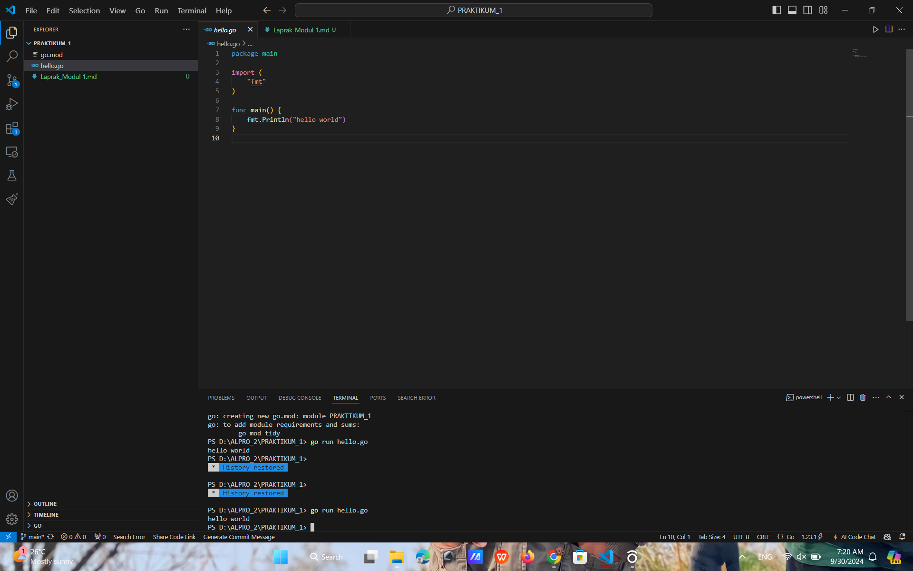

# <h1 align="center">Laporan Praktikum Modul 1 - Hello World</h1>
<p align="center">Naufal Luthfi Assary</p>
<p align="center">2311102125</p>

### 1. Hello World.

```GO
package main

import (
	"fmt"
)

func main() {
    fmt.Println("hello world!")
}
```

#### Output:
