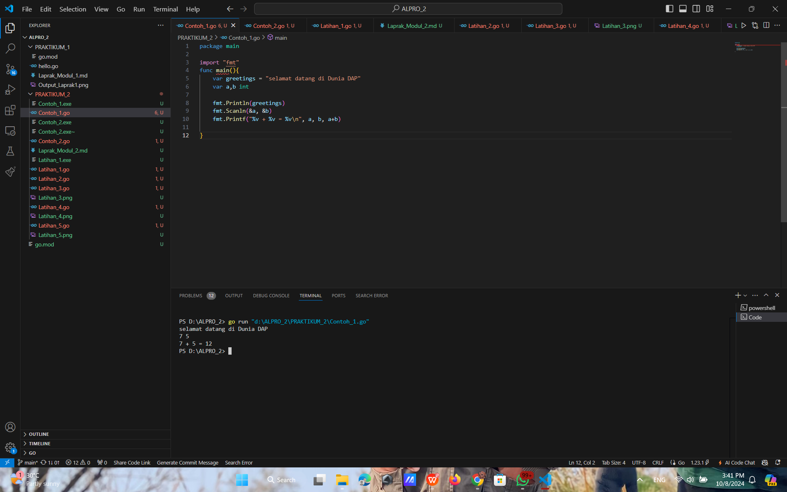
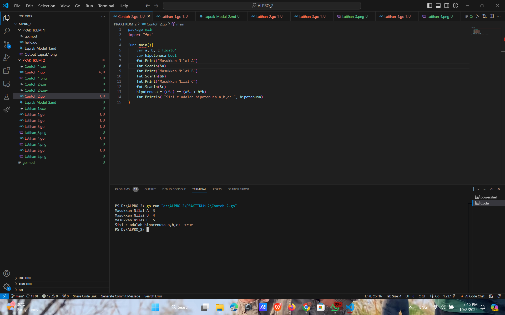
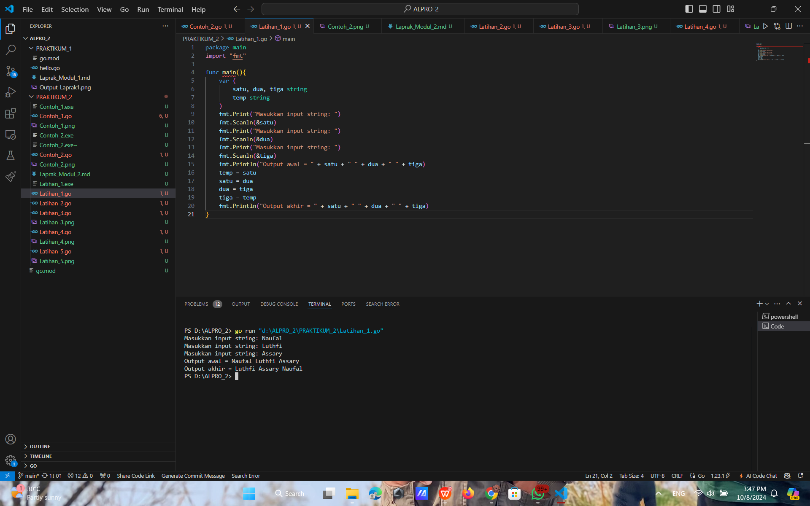
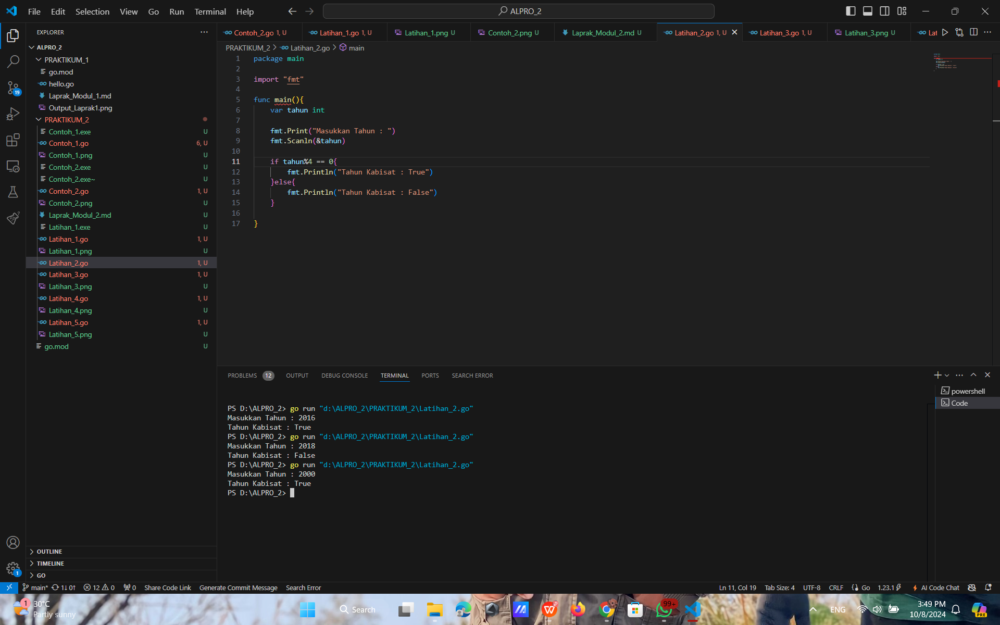
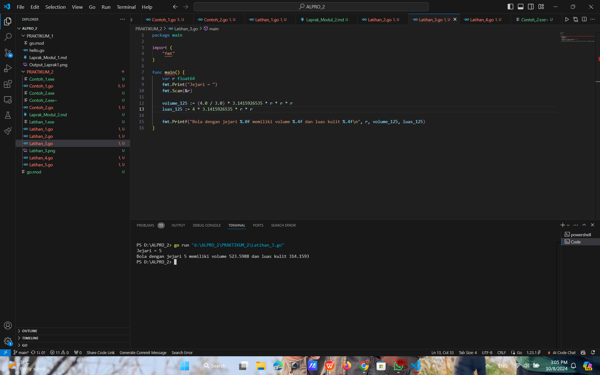
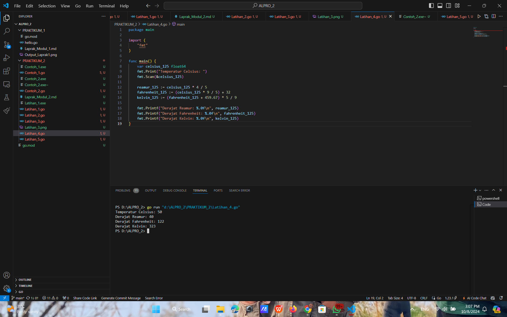
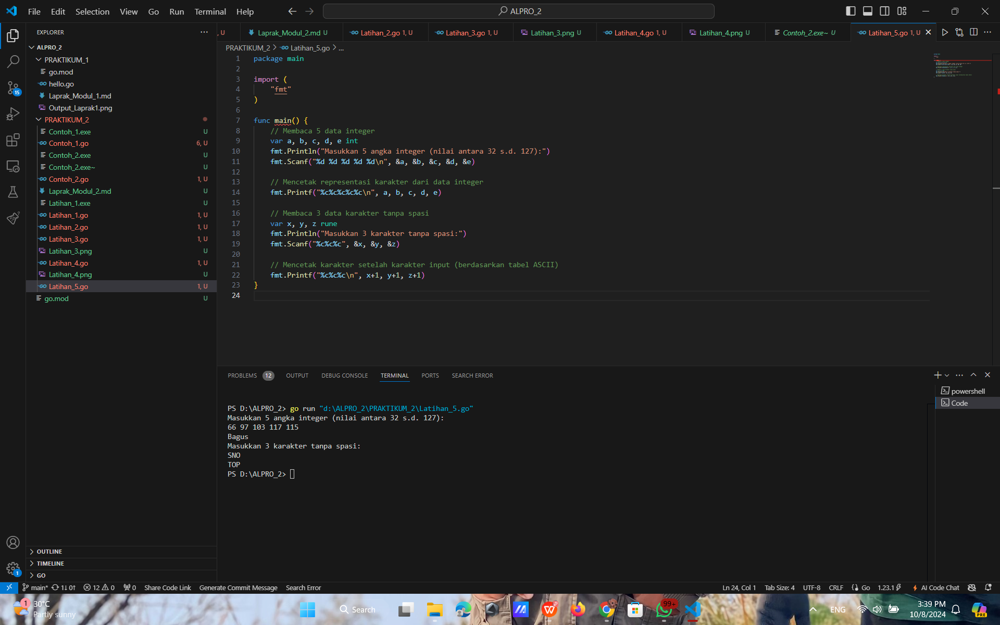

# <h1 align="center">Laporan Praktikum Modul 2 - Review Struktur Kontrol</h1>
<p align="center">Naufal Luthfi Assary</p>
<p align="center">2311102125</p>

## Contoh
### Contoh 1. Program "Hello".

```GO
package main

import "fmt"
func main(){
	var greetings = "selamat datang di Dunia DAP"
	var a,b int

	fmt.Println(greetings)
	fmt.Scanln(&a, &b)
	fmt.Printf("%v + %v = %v\n", a, b, a+b)
 
}
```

#### Output:


### Contoh 2. Program "Hipotenusa.

```GO
package main 
import "fmt"

func main(){
	var a, b, c float64
	var hipotenusa bool
	fmt.Print("Masukkan Nilai A")
	fmt.Scanln(&a)
	fmt.Print("Masukkan Nilai B")
	fmt.Scanln(&b)
	fmt.Print("Masukkan Nilai C")
	fmt.Scanln(&c)
	hipotenusa = (c*c) == (a*a + b*b)
	fmt.Println( "Sisi c adalah hipotenusa a,b,c: ", hipotenusa)
}
```

#### Output:


## Latihan
### Latihan 1.

```GO
package main
import "fmt"

func main(){
	var (
		satu, dua, tiga string
		temp string
	)
	fmt.Print("Masukkan input string: ")
	fmt.Scanln(&satu)
	fmt.Print("Masukkan input string: ")
	fmt.Scanln(&dua)
	fmt.Print("Masukkan input string: ")
	fmt.Scanln(&tiga)
	fmt.Println("Output awal = " + satu + " " + dua + " " + tiga)
	temp = satu
	satu = dua
	dua = tiga
	tiga = temp
	fmt.Println("Output akhir = " + satu + " " + dua + " " + tiga)
}
```

#### Output:


### Latihan 2.

```GO
package main

import "fmt"

func main(){
	var tahun int

	fmt.Print("Masukkan Tahun : ")
	fmt.Scanln(&tahun)

	if tahun%4 == 0{
		fmt.Println("Tahun Kabisat : True")
	}else{
		fmt.Println("Tahun Kabisat : False")
	}
	
}
```

#### Output:


### Latihan 3.

```GO
package main

import (
	"fmt"
)

func main() {
	var r float64
	fmt.Print("Jejari = ")
	fmt.Scan(&r)

	volume_125 := (4.0 / 3.0) * 3.1415926535 * r * r * r
	luas_125 := 4 * 3.1415926535 * r * r

	fmt.Printf("Bola dengan jejari %.0f memiliki volume %.4f dan luas kulit %.4f\n", r, volume_125, luas_125)
}
```

#### Output:


### Latihan 4.

```GO
package main

import (
	"fmt"
)

func main() {
	var celsius_125 float64
	fmt.Print("Temperatur Celsius: ")
	fmt.Scan(&celsius_125)

	reamur_125 := celsius_125 * 4 / 5
	fahrenheit_125 := (celsius_125 * 9 / 5) + 32
	kelvin_125 := (fahrenheit_125 + 459.67) * 5 / 9

	fmt.Printf("Derajat Reamur: %.0f\n", reamur_125)
	fmt.Printf("Derajat Fahrenheit: %.0f\n", fahrenheit_125)
	fmt.Printf("Derajat Kelvin: %.0f\n", kelvin_125)
}
```

#### Output:


### Latihan 5.

```GO
package main

import (
	"fmt"
)

func main() {
	// Membaca 5 data integer
	var a, b, c, d, e int
	fmt.Println("Masukkan 5 angka integer (nilai antara 32 s.d. 127):")
	fmt.Scanf("%d %d %d %d %d\n", &a, &b, &c, &d, &e)

	// Mencetak representasi karakter dari data integer
	fmt.Printf("%c%c%c%c%c\n", a, b, c, d, e)

	// Membaca 3 data karakter tanpa spasi
	var x, y, z rune
	fmt.Println("Masukkan 3 karakter tanpa spasi:")
	fmt.Scanf("%c%c%c", &x, &y, &z)

	// Mencetak karakter setelah karakter input (berdasarkan tabel ASCII)
	fmt.Printf("%c%c%c\n", x+1, y+1, z+1)
}
```

#### Output:


