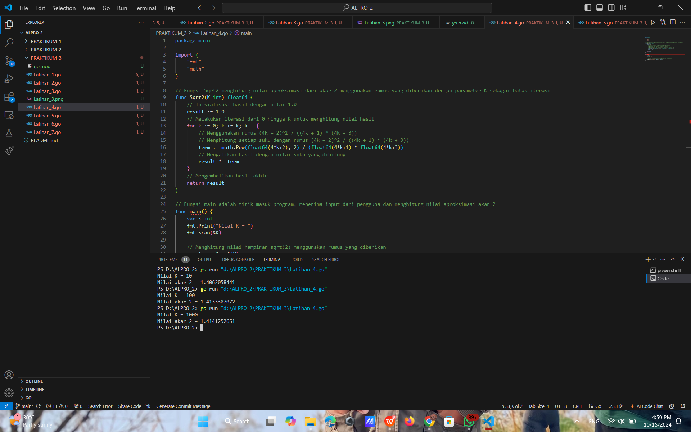

# <h1 align="center">Laporan Praktikum Modul 3 - Perulangan & Percabangan</h1>
<p align="center">Naufal Luthfi Assary</p>
<p align="center">2311102125</p>

## Latihan
### Latihan 1.

```GO
package main
import (
	"fmt"
)

func main(){
	urutanBenar := []string{"merah", "kuning", "hijau", "ungu"}
	hasil := true

	for i := 1; i <= 5; i++ {
		var warna1, warna2, warna3, warna4 string
		fmt.Printf("Percobaan %d\n", i)
		fmt.Print("Masukan warna pertama : ")
		fmt.Scanln(&warna1)
		fmt.Print("Masukan warna kedua : ")
		fmt.Scanln(&warna2)
		fmt.Print("Masukan warna ketiga : ")
		fmt.Scanln(&warna3)
		fmt.Print("Masukan warna keempat : ")
		fmt.Scanln(&warna4)

		//Periksa apakah urutan warna sesuai
		if warna1 != urutanBenar[0] || warna2 != urutanBenar[1] ||
			warna3 != urutanBenar[2] || warna4 != urutanBenar[3] {
				hasil = false
			}
	}

	//Tampilkan hasil
	fmt.Println("BERHASIL:", hasil)

}
```

#### Output:


### Latihan 2.

```GO
package main

import (
	"bufio"
	"fmt"
	"os"
	"strings"
)

func main() {
	scanner := bufio.NewScanner(os.Stdin)
	var pita string
	var bungaCount int

	for {
		fmt.Printf("Bunga %d: ", bungaCount+1)
		scanner.Scan()
		input := scanner.Text()
		
		if strings.ToLower(input) == "selesai" {
			break
		}

		if pita == "" {
			pita = input
		} else {
			pita += " - " + input
		}
		bungaCount++
	}

	fmt.Printf("Pita: %s\n", pita)
	fmt.Printf("Bunga: %d\n", bungaCount)
}
```

#### Output:


### Latihan 3.

```GO
package main

import (
	"fmt"
	"math"
)

func main() {
	for i := 1; i <= 4; i++ {
	var berat1, berat2 float64

	for {
		fmt.Print("Masukkan berat belanjaan di kedua kantong: ")
		fmt.Scan(&berat1, &berat2)

		// Cek jika salah satu kantong beratnya negatif
		if berat1 < 0 || berat2 < 0 {
			fmt.Println("Proses selesai.")
			break
		}

		// Cek jika total berat kedua kantong melebihi 150 kg
		if berat1+berat2 > 150 {
			fmt.Println("Proses selesai.")
			break
		}

		// Cek apakah selisih berat di kedua kantong lebih dari atau sama dengan 9 kg
		if math.Abs(berat1-berat2) >= 9 {
			fmt.Println("Sepeda motor Pak Andi akan oleng: true")
		} else {
			fmt.Println("Sepeda motor Pak Andi akan oleng: false")
		}
		}
	}
}
```

#### Output:


### Latihan 4.

```GO
package main

import (
	"fmt"
	"math"
)

// Fungsi Sqrt2 menghitung nilai aproksimasi dari akar 2 menggunakan rumus yang diberikan dengan parameter K sebagai batas iterasi
func Sqrt2(K int) float64 {
	// Inisialisasi hasil dengan nilai 1.0
	result := 1.0
	// Melakukan iterasi dari 0 hingga K untuk menghitung nilai hasil
	for k := 0; k <= K; k++ {
		// Menggunakan rumus (4k + 2)^2 / ((4k + 1) * (4k + 3))
		// Menghitung setiap suku dengan rumus (4k + 2)^2 / ((4k + 1) * (4k + 3))
		term := math.Pow(float64(4*k+2), 2) / (float64(4*k+1) * float64(4*k+3))
		// Mengalikan hasil dengan nilai suku yang dihitung
		result *= term
	}
	// Mengembalikan hasil akhir
	return result
}

// Fungsi main adalah titik masuk program, menerima input dari pengguna dan menghitung nilai aproksimasi akar 2
func main() {
	for i := 1; i <= 3; i++ {
	var K int
	fmt.Print("Nilai K = ")
	fmt.Scan(&K)

	// Menghitung nilai hampiran sqrt(2) menggunakan rumus yang diberikan
	result := Sqrt2(K)
	fmt.Printf("Nilai akar 2 = %.10f\n", result)
	}
}
```

#### Output:


### Latihan 5.

```GO
package main

import (
	"fmt"
)

func main() {
	for i := 1; i <= 3; i++ {
		var beratParsel int

		// Meminta input berat parsel dalam gram dari pengguna
		fmt.Printf("Berat parsel #%d (gram): ", i)
		fmt.Scan(&beratParsel)

		// Menghitung total berat dalam kilogram dan sisa gramnya
		totalKg := beratParsel / 1000
		sisaGram := beratParsel % 1000
		// Biaya per kilogram adalah Rp. 10.000
		biayaPerKg := 10000
		biayaTambahan := 0

		// Menghitung biaya tambahan berdasarkan sisa gram
		if sisaGram > 0 {
			if sisaGram <= 500 {
				// Jika sisa gram kurang dari atau sama dengan 500 gram, biaya tambahan Rp. 5 per gram
				biayaTambahan = sisaGram * 5
			} else {
				// Jika sisa gram lebih dari 500 gram, biaya tambahan Rp. 15 per gram
				biayaTambahan = sisaGram * 15
			}
		}

		// Menghitung total biaya
		totalBiaya := (totalKg * biayaPerKg) + biayaTambahan

		// Jika total berat lebih dari atau sama dengan 10 kg, biaya sisa gram dihapuskan
		if totalKg >= 10 {
			biayaTambahan = 0
			totalBiaya = totalKg * biayaPerKg
		}

		// Menampilkan detail berat dan biaya
		fmt.Printf("Detail berat: %d kg + %d gram\n", totalKg, sisaGram)
		fmt.Printf("Detail biaya: Rp. %d + Rp. %d\n", totalKg*biayaPerKg, biayaTambahan)
		fmt.Printf("Total biaya: Rp. %d\n", totalBiaya)
		fmt.Println() // Untuk memisahkan setiap output program
	}
}
```

#### Output:


### Latihan 6.

```GO
// Sebelum diperbaiki

package main
import "fmt"
func main() {
    var nam float64
    var nmk string
    fmt.Print("Nilai akhir mata kuliah: ")
    fmt.Scanln(&nam)

    if nam > 80 {
        nmk = "A"
    } 
	if nam > 72.5 {
        nmk = "AB"
    } 
	if nam > 65 {
        nmk = "B"
    } 
	if nam > 57.5 {
        nmk = "BC"
    } 
	if nam > 50 {
        nmk = "C"
    } 
	if nam > 40 {
        nmk = "D"
    } else if nam <= 40{
        nmk = "E"
    }

    fmt.Println("Nilai mata kuliah: ", nmk)
}
```

#### Output:

##### a. Jika nam diberikan adalah 80.1, apa keluaran dari program tersebut? Apakah eksekusi program tersebut sesuai spesifikasi soal?
hasil keluaran untuk input 80.1 adalah "D", yang tidak sesuai dengan spesifikasi soal. Program seharusnya memberikan hasil "A" untuk nilai di atas 80, tetapi karena tidak ada blok else if, variabel nmk terus ditimpa hingga kondisi terakhir terpenuhi.

##### b. Apa saja kesalahan dari program tersebut? Mengapa demikian? Jelaskan alur program seharusnya!
###### Kesalahan dalam Program Sebelum Perbaikan:
1. Semua Kondisi Menggunakan if Terpisah:
Tidak menggunakan else if, sehingga setiap kondisi if berdiri sendiri. Ketika nam lebih besar dari beberapa batas nilai, program akan mengevaluasi semua if dan menimpa nilai nmk berkali-kali.
Contoh: Jika nam = 80.1, nilai nmk akan diubah menjadi "A", lalu "AB", "B", "BC", "C", dan akhirnya "D". Nilai terakhir yang akan dicetak adalah "D", bukan "A".

2. Tidak Ada Penghentian Evaluasi:
Setiap kondisi dievaluasi secara independen, menyebabkan nilai nmk diubah beberapa kali dalam alur eksekusi yang tidak seharusnya terjadi.

###### Alur Program yang Seharusnya:
1. Program harus mengevaluasi nilai nam secara berurutan dan berhenti ketika kondisi sudah terpenuhi. Menggunakan else if akan memastikan bahwa setelah satu kondisi benar, evaluasi lainnya dihentikan.

2. Dengan else if, jika nam = 80.1, kondisi if nam > 80 terpenuhi, nilai nmk menjadi "A", dan program berhenti mengevaluasi kondisi lainnya, sehingga hasil yang dicetak adalah benar ("A").

Kesimpulannya, alur yang benar adalah menggunakan else if untuk menghindari penilaian berulang dan memastikan nilai nmk di-set sesuai dengan kriteria penilaian yang diinginkan.

##### c. Perbaiki program tersebut! Ujilah dengan masukan: 93.5; 70.6; dan 49.5. Seharusnya keluaran yang diperoleh adalah 'A', 'B', dan 'D'.
```GO
// Sesudah diperbaiki

package main
import "fmt"

func main() {
	for i := 1; i <= 3; i++ {
    var nam float64
    var nmk string
    fmt.Print("Nilai akhir mata kuliah: ")
    fmt.Scanln(&nam)

    if nam > 80 {
        nmk = "A"
    } else if nam > 72.5 {
        nmk = "AB"
    } else if nam > 65 {
        nmk = "B"
    } else if nam > 57.5 {
        nmk = "BC"
    } else if nam > 50 {
        nmk = "C"
    } else if nam > 40 {
        nmk = "D"
    } else {
        nmk = "E"
    }

    fmt.Println("Nilai mata kuliah: ", nmk)
	}
}
```
#### Output:


### Latihan 7.

```GO
package main

import (
	"fmt"
)

func main() {
    
	var bilangan int
	fmt.Print("Bilangan: ") // Meminta pengguna untuk memasukkan bilangan
	fmt.Scan(&bilangan) // Membaca input bilangan dari pengguna

	// Mengecek apakah bilangan lebih kecil atau sama dengan 1
	if bilangan <= 1 {
		fmt.Println("Bilangan harus lebih besar dari 1.")
		return // Menghentikan program jika bilangan tidak valid
	}

	// Mendapatkan semua faktor dari bilangan
	faktor := cariFaktor(bilangan)
	fmt.Print("Faktor: ")
	for _, f := range faktor {
		fmt.Printf("%d ", f) // Menampilkan setiap faktor
	}
	fmt.Println()

	// Mengecek apakah bilangan adalah bilangan prima
	if cariPrima(bilangan) {
		fmt.Println("Prima: true") // Menampilkan bahwa bilangan adalah prima
	} else {
		fmt.Println("Prima: false") // Menampilkan bahwa bilangan bukan prima
	}
}

// Fungsi untuk mencari faktor dari bilangan n
func cariFaktor(n int) []int {
	var faktor []int
	for i := 1; i <= n; i++ {
		if n%i == 0 {
			faktor = append(faktor, i) // Menambahkan faktor ke dalam slice faktor
		}
	}
	return faktor // Mengembalikan slice yang berisi semua faktor
}

// Fungsi untuk mengecek apakah bilangan n adalah bilangan prima
func cariPrima(n int) bool {
	if n <= 1 {
		return false // Mengembalikan false jika bilangan kurang dari atau sama dengan 1
	}
	for i := 2; i*i <= n; i++ {
		if n%i == 0 {
			return false // Mengembalikan false jika ditemukan pembagi selain 1 dan bilangan itu sendiri
		}
	}
	return true // Mengembalikan true jika tidak ada pembagi selain 1 dan bilangan itu sendiri
}
```

#### Output:


