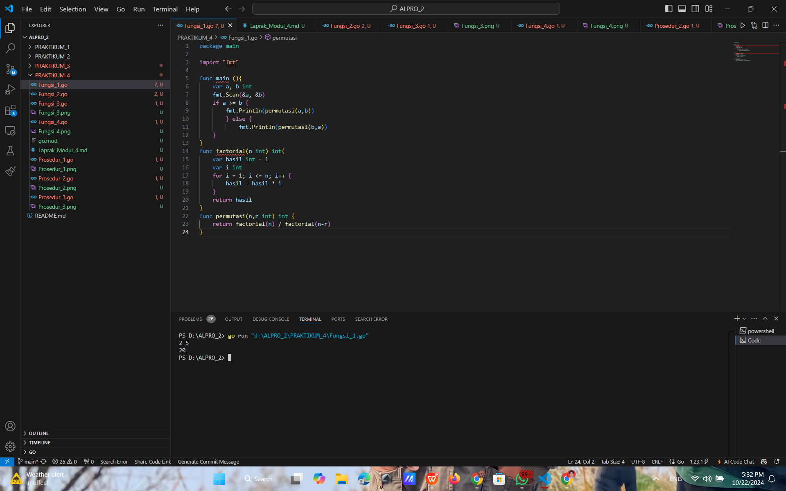
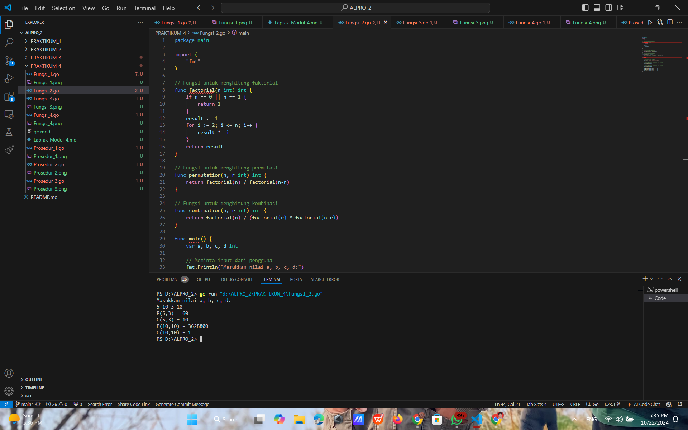
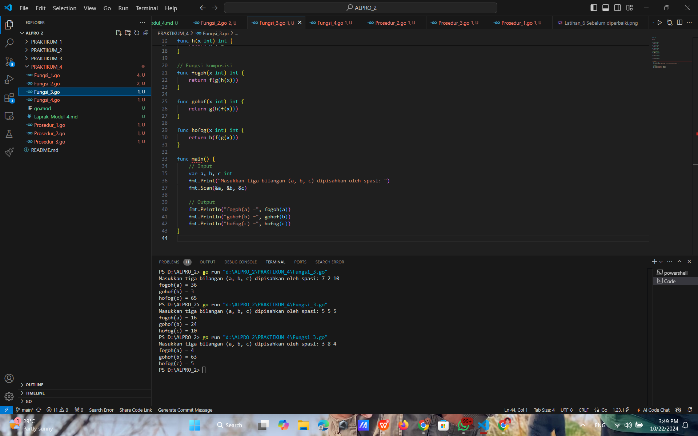
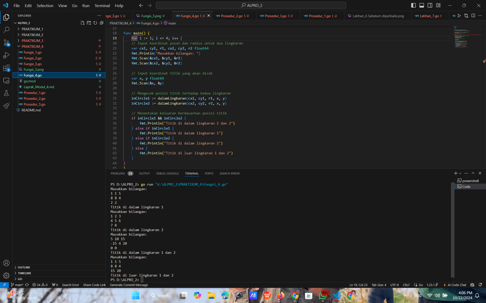

# <h1 align="center">Laporan Praktikum Modul 3 - Perulangan & Percabangan</h1>
<p align="center">Naufal Luthfi Assary</p>
<p align="center">2311102125</p>

## Fungsi
### Fungsi 1.

```GO
package main

import "fmt"

func main (){
	var a, b int
	fmt.Scan(&a, &b)
	if a >= b {
		fmt.Println(permutasi(a,b))
		} else {
			fmt.Println(permutasi(b,a))
	}
}
func factorial(n int) int{
	var hasil int = 1
	var i int
	for i = 1; i <= n; i++ {
		hasil = hasil * i
	}
	return hasil
}
func permutasi(n,r int) int {
	return factorial(n) / factorial(n-r)
}
```

#### Output:


### Fungsi 2.

```GO
package main

import (
	"fmt"
)

// Fungsi untuk menghitung faktorial
func factorial(n int) int {
	if n == 0 || n == 1 {
		return 1
	}
	result := 1
	for i := 2; i <= n; i++ {
		result *= i
	}
	return result
}

// Fungsi untuk menghitung permutasi
func permutation(n, r int) int {
	return factorial(n) / factorial(n-r)
}

// Fungsi untuk menghitung kombinasi
func combination(n, r int) int {
	return factorial(n) / (factorial(r) * factorial(n-r))
}

func main() {
	var a, b, c, d int

	// Meminta input dari pengguna
	fmt.Println("Masukkan nilai a, b, c, d:")
	fmt.Scan(&a, &b, &c, &d)

	// Menghitung permutasi dan kombinasi untuk a terhadap c
	p1 := permutation(a, c)
	c1 := combination(a, c)

	// Menghitung permutasi dan kombinasi untuk b terhadap d
	p2 := permutation(b, d)
	c2 := combination(b, d)

	// Output hasil 
	fmt.Printf("P(%d,%d) = %d\n", a, c, p1)
	fmt.Printf("C(%d,%d) = %d\n", a, c, c1)
	fmt.Printf("P(%d,%d) = %d\n", b, d, p2)
	fmt.Printf("C(%d,%d) = %d\n", b, d, c2)
}

```

#### Output:


### Fungsi 3.

```GO
package main

import (
	"fmt"
)

// Definisi fungsi
func f(x int) int {
	return x * x
}

func g(x int) int {
	return x - 2
}

func h(x int) int {
	return x + 1
}

// Fungsi komposisi
func fogoh(x int) int {
	return f(g(h(x)))
}

func gohof(x int) int {
	return g(h(f(x)))
}

func hofog(x int) int {
	return h(f(g(x)))
}

func main() {
	// Input
	var a, b, c int
	fmt.Print("Masukkan tiga bilangan (a, b, c) dipisahkan oleh spasi: ")
	fmt.Scan(&a, &b, &c)

	// Output
	fmt.Println("fogoh(a) =", fogoh(a))
	fmt.Println("gohof(b) =", gohof(b))
	fmt.Println("hofog(c) =", hofog(c))
}

```

#### Output:


### Fungsi 4.

```GO
package main

import (
	"fmt"
	"math"
)

// Fungsi untuk menghitung jarak antara dua titik
func jarak(x1, y1, x2, y2 float64) float64 {
	return math.Sqrt(math.Pow(x2-x1, 2) + math.Pow(y2-y1, 2))
}

// Fungsi untuk mengecek apakah titik berada di dalam lingkaran
func dalamLingkaran(cx, cy, r, x, y float64) bool {
	return jarak(cx, cy, x, y) <= r
}

func main() {
	for i := 1; i <= 4; i++ {
	// Input koordinat pusat dan radius untuk dua lingkaran
	var cx1, cy1, r1, cx2, cy2, r2 float64
	fmt.Println("Masukkan bilangan: ")
	fmt.Scan(&cx1, &cy1, &r1)
	fmt.Scan(&cx2, &cy2, &r2)

	// Input koordinat titik yang akan dicek
	var x, y float64
	fmt.Scan(&x, &y)

	// Mengecek posisi titik terhadap kedua lingkaran
	inCircle1 := dalamLingkaran(cx1, cy1, r1, x, y)
	inCircle2 := dalamLingkaran(cx2, cy2, r2, x, y)

	// Menentukan keluaran berdasarkan posisi titik
	if inCircle1 && inCircle2 {
		fmt.Println("Titik di dalam lingkaran 1 dan 2")
	} else if inCircle1 {
		fmt.Println("Titik di dalam lingkaran 1")
	} else if inCircle2 {
		fmt.Println("Titik di dalam lingkaran 2")
	} else {
		fmt.Println("Titik di luar lingkaran 1 dan 2")
	}
}
}

```

#### Output:


## Prosedur
### Prosedur 1.

```GO
package main

import (
	"fmt"
)

// Fungsi rekursif untuk menghitung deret Fibonacci
func fibonacci(n int) int {
	if n == 0 {
		return 0
	} else if n == 1 {
		return 1
	} else {
		return fibonacci(n-1) + fibonacci(n-2)
	}
}

func main() {
	// Menampilkan deret Fibonacci hingga suku ke-10
	fmt.Println("Deret Fibonacci hingga suku ke-10:")
	for i := 0; i <= 10; i++ {
		fmt.Printf("Fibonacci(%d) = %d\n", i, fibonacci(i))
	}
}
```

#### Output:


### Prosedur 2.

```GO
package main

import (
    "bufio"   
    "fmt"     
    "os"      // digunakan untuk akses ke fungsi sistem operasi, seperti membaca input dari standar input
    "strings" // digunakan untuk memanipulasi string, seperti memisahkan input menjadi bagian-bagian
    "strconv" // digunakan untuk mengubah string menjadi tipe data lain, seperti integer
)

// Prosedur untuk menghitung skor dan total waktu dari soal yang dikerjakan peserta
func hitungSkor(soal []int) (int, int) {
    totalSkor := 0
    totalWaktu := 0

    for _, waktu := range soal {
        if waktu <= 300 {
            totalSkor++
            totalWaktu += waktu
        } else {
            totalWaktu += 0
        }
    }

    return totalSkor, totalWaktu
}

// Fungsi utama untuk membaca input, memproses data peserta, dan menentukan pemenang
func main() {
    scanner := bufio.NewScanner(os.Stdin)
    var pemenang string
    maxSkor := -1
    minWaktu := 999999
    var skor, totalWaktu int

    fmt.Println("Masukkan data peserta, akhiri dengan 'Selesai':")
    for scanner.Scan() {
        input := scanner.Text()
        if strings.ToLower(input) == "selesai" {
            break
        }

        // Memisahkan input menjadi nama peserta dan waktu pengerjaan soal
        data := strings.Fields(input)
        if len(data) != 9 {
            fmt.Println("Input tidak valid, pastikan formatnya: nama waktu1 waktu2 ... waktu8")
            continue
        }

        peserta := data[0]
        soal := make([]int, 8)
        valid := true

        // Mengubah waktu pengerjaan dari string ke integer
        for i := 1; i <= 8; i++ {
            waktu, err := strconv.Atoi(data[i])
            if err != nil {
                fmt.Println("Waktu harus berupa angka.")
                valid = false
                break
            }
            soal[i-1] = waktu
        }

        if !valid {
            continue
        }

        // Menghitung skor dan total waktu untuk peserta saat ini
        skor, totalWaktu = hitungSkor(soal)

        // Tentukan pemenang berdasarkan jumlah soal yang diselesaikan dan waktu total
        if skor > maxSkor || (skor == maxSkor && totalWaktu < minWaktu) {
            maxSkor = skor
            minWaktu = totalWaktu
            pemenang = peserta
        }
    }

    // Mencetak hasil pemenang
    if pemenang != "" {
        fmt.Printf("%s %d %d\n", pemenang, maxSkor, minWaktu)
    } else {
        fmt.Println("Tidak ada peserta yang valid.")
    }
}
```

#### Output:


### Prosedur 3.

```GO
package main

import (
	"fmt"
)

// Procedure cetakDeret mencetak deret bilangan sesuai aturan Skiena
func cetakDeret(n int) {
	for n != 1 {
		fmt.Printf("%d ", n)
		if n%2 == 0 {
			n = n / 2
		} else {
			n = 3*n + 1
		}
	}
	fmt.Printf("%d\n", n) // Cetak 1 sebagai elemen terakhir deret
}

func main() {
	var n int
	fmt.Print("Masukkan nilai awal): ")
	fmt.Scan(&n)
	if n > 0 && n < 1000000 {
		cetakDeret(n)
	} else {
		fmt.Println("Nilai harus berupa bilangan positif")
	}
}

```

#### Output:


