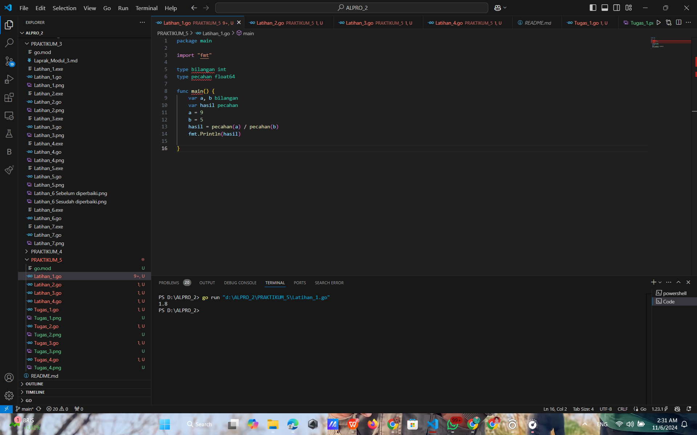
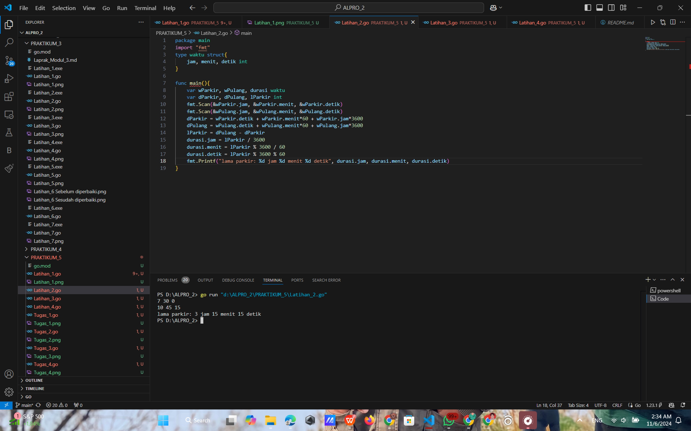
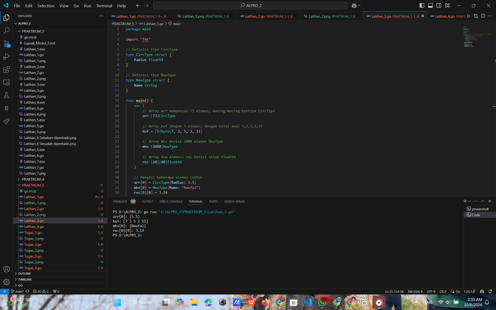
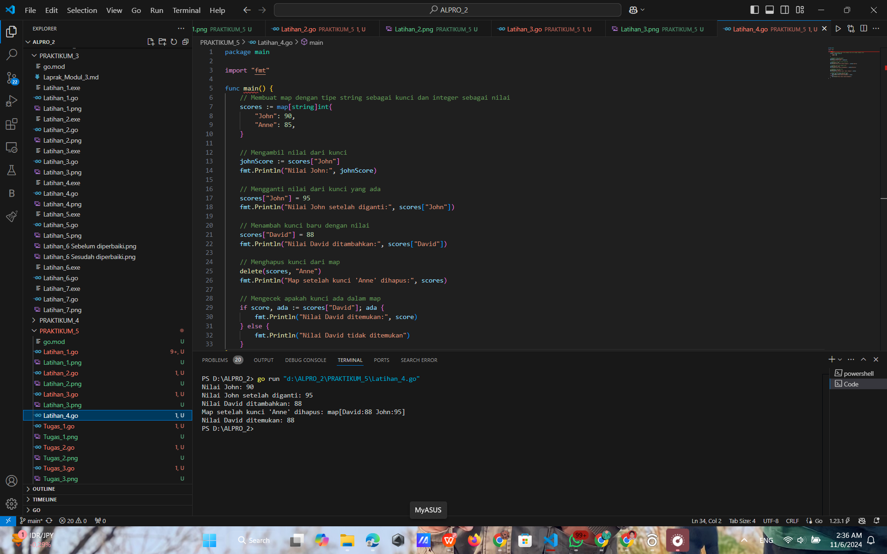
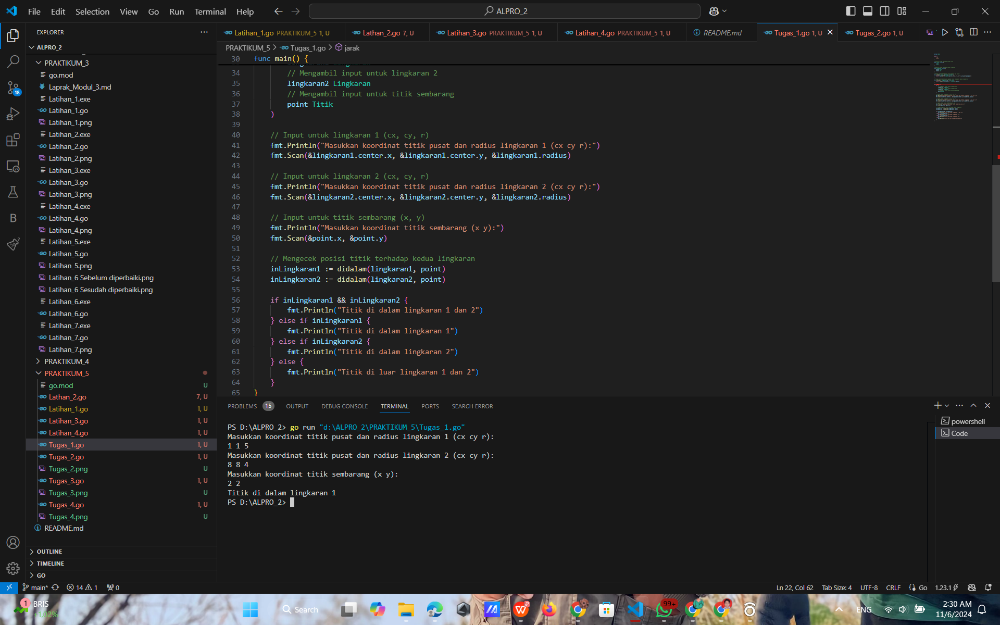
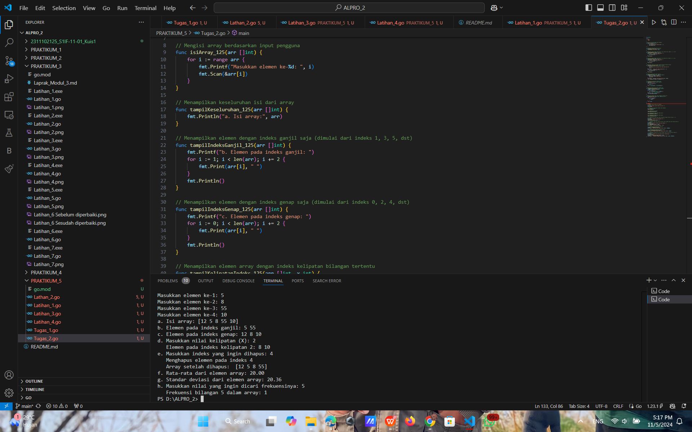
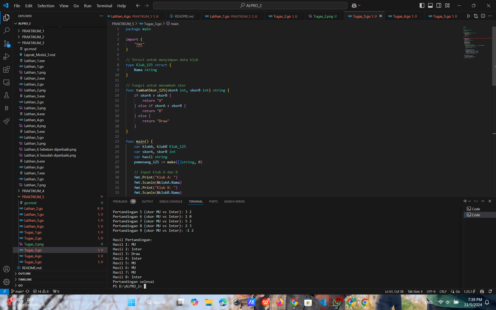
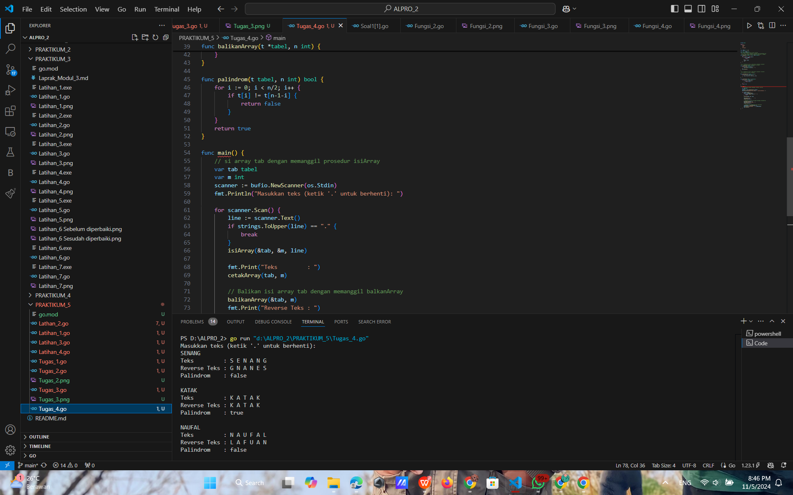

# <h1 align="center">Laporan Praktikum Modul 5 - Struct & Array</h1>
<p align="center">Naufal Luthfi Assary</p>
<p align="center">2311102125</p>

## Latihan
### Latihan 1.

```GO
package main

import "fmt"

type bilangan int
type pecahan float64

func main() {
	var a, b bilangan
	var hasil pecahan
	a = 9
	b = 5
	hasil = pecahan(a) / pecahan(b)
	fmt.Println(hasil)

}
```

#### Output:


### Latihan 2.

```GO
package main
import "fmt"
type waktu struct{
	jam, menit, detik int
}

func main(){
	var wParkir, wPulang, durasi waktu
	var dParkir, dPulang, lParkir int
	fmt.Scan(&wParkir.jam, &wParkir.menit, &wParkir.detik)
	fmt.Scan(&wPulang.jam, &wPulang.menit, &wPulang.detik)
	dParkir = wParkir.detik + wParkir.menit*60 + wParkir.jam*3600
	dPulang = wPulang.detik + wPulang.menit*60 + wPulang.jam*3600
	lParkir = dPulang - dParkir
	durasi.jam = lParkir / 3600
	durasi.menit = lParkir % 3600 / 60
	durasi.detik = lParkir % 3600 % 60
	fmt.Printf("lama parkir: %d jam %d menit %d detik", durasi.jam, durasi.menit, durasi.detik)
}
```

#### Output:


### Latihan 3.

```GO
package main

import "fmt"

// Definisi tipe CircType
type CircType struct {
	Radius float64
}

// Definisi tipe NewType
type NewType struct {
	Name string
}

func main() {
	var (
		// Array arr mempunyai 73 elemen, masing-masing bertipe CircType
		arr [73]CircType

		// Array buf dengan 5 elemen, dengan nilai awal 7,3,5,2,11
		buf = [5]byte{7, 3, 5, 2, 11}

		// Array mhs berisi 2000 elemen NewType
		mhs [2000]NewType

		// Array dua dimensi rec berisi nilai float64
		rec [20][40]float64
	)

	// Mengisi beberapa elemen contoh
	arr[0] = CircType{Radius: 5.5}
	mhs[0] = NewType{Name: "Naufal"}
	rec[0][0] = 3.14

	// Contoh penggunaan variabel
	fmt.Println("arr[0]:", arr[0])
	fmt.Println("buf:", buf)
	fmt.Println("mhs[0]:", mhs[0])
	fmt.Println("rec[0][0]:", rec[0][0])
}
```

#### Output:


### Latihan 4.

```GO
package main

import "fmt"

func main() {
	// Membuat map dengan tipe string sebagai kunci dan integer sebagai nilai
	scores := map[string]int{
		"John": 90,
		"Anne": 85,
	}

	// Mengambil nilai dari kunci
	johnScore := scores["John"]
	fmt.Println("Nilai John:", johnScore)

	// Mengganti nilai dari kunci yang ada
	scores["John"] = 95
	fmt.Println("Nilai John setelah diganti:", scores["John"])

	// Menambah kunci baru dengan nilai
	scores["David"] = 88
	fmt.Println("Nilai David ditambahkan:", scores["David"])

	// Menghapus kunci dari map
	delete(scores, "Anne")
	fmt.Println("Map setelah kunci 'Anne' dihapus:", scores)

	// Mengecek apakah kunci ada dalam map
	if score, ada := scores["David"]; ada {
		fmt.Println("Nilai David ditemukan:", score)
	} else {
		fmt.Println("Nilai David tidak ditemukan")
	}
}
```

#### Output:


## Tugas
### Tugas 1.

```GO
package main

import (
	"fmt"
	"math"
)

// Definisi tipe bentukan untuk titik
type Titik struct {
	x int
	y int
}

// Definisi tipe bentukan untuk lingkaran
type Lingkaran struct {
	center Titik
	radius int
}

// Fungsi untuk menghitung jarak antara dua titik
func jarak(p Titik, q Titik) float64 {
	return math.Sqrt(float64((p.x-q.x)*(p.x-q.x) + (p.y-q.y)*(p.y-q.y)))
}

// Fungsi untuk menentukan apakah titik berada di dalam lingkaran
func didalam(c Lingkaran, p Titik) bool {
	return jarak(p, c.center) < float64(c.radius)
}

func main() {
	var (
		// Mengambil input untuk lingkaran 1
		lingkaran1 Lingkaran
		// Mengambil input untuk lingkaran 2
		lingkaran2 Lingkaran
		// Mengambil input untuk titik sembarang
		point Titik
	)

	// Input untuk lingkaran 1 (cx, cy, r)
	fmt.Println("Masukkan koordinat titik pusat dan radius lingkaran 1 (cx cy r):")
	fmt.Scan(&lingkaran1.center.x, &lingkaran1.center.y, &lingkaran1.radius)

	// Input untuk lingkaran 2 (cx, cy, r)
	fmt.Println("Masukkan koordinat titik pusat dan radius lingkaran 2 (cx cy r):")
	fmt.Scan(&lingkaran2.center.x, &lingkaran2.center.y, &lingkaran2.radius)

	// Input untuk titik sembarang (x, y)
	fmt.Println("Masukkan koordinat titik sembarang (x y):")
	fmt.Scan(&point.x, &point.y)

	// Mengecek posisi titik terhadap kedua lingkaran
	inLingkaran1 := didalam(lingkaran1, point)
	inLingkaran2 := didalam(lingkaran2, point)

	if inLingkaran1 && inLingkaran2 {
		fmt.Println("Titik di dalam lingkaran 1 dan 2")
	} else if inLingkaran1 {
		fmt.Println("Titik di dalam lingkaran 1")
	} else if inLingkaran2 {
		fmt.Println("Titik di dalam lingkaran 2")
	} else {
		fmt.Println("Titik di luar lingkaran 1 dan 2")
	}
}
```

#### Output:


### Tugas 2.

```GO
package main

import (
    "fmt"
    "math"
)

// Mengisi array berdasarkan input pengguna
func isiArray_125(arr []int) {
    for i := range arr {
        fmt.Printf("Masukkan elemen ke-%d: ", i)
        fmt.Scan(&arr[i])
    }
}

// Menampilkan keseluruhan isi dari array
func tampilKeseluruhan_125(arr []int) {
    fmt.Println("a. Isi array:", arr)
}

// Menampilkan elemen dengan indeks ganjil saja (dimulai dari indeks 1, 3, 5, dst)
func tampilIndeksGanjil_125(arr []int) {
    fmt.Printf("b. Elemen pada indeks ganjil: ")
    for i := 1; i < len(arr); i += 2 {
        fmt.Print(arr[i], " ")
    }
    fmt.Println()
}

// Menampilkan elemen dengan indeks genap saja (dimulai dari indeks 0, 2, 4, dst)
func tampilIndeksGenap_125(arr []int) {
    fmt.Printf("c. Elemen pada indeks genap: ")
    for i := 0; i < len(arr); i += 2 {
        fmt.Print(arr[i], " ")
    }
    fmt.Println()
}

// Menampilkan elemen array dengan indeks kelipatan bilangan tertentu
func tampilKelipatanIndeks_125(arr []int, x int) {
    if x <= 0 {
        fmt.Println("Nilai kelipatan harus lebih besar dari 0")
        return
    }
    fmt.Printf("   Elemen pada indeks kelipatan %d: ", x)
    for i := x; i < len(arr); i += x {
        fmt.Print(arr[i], " ")
    }
    fmt.Println()
}

// Menghapus elemen pada indeks tertentu
func hapusIndeks_125(arr []int, index int) []int {
    if index < 0 || index >= len(arr) {
        fmt.Println("Indeks tidak valid")
        return arr
    }
    fmt.Printf("   Menghapus elemen pada indeks %d\n", index)
    return append(arr[:index], arr[index+1:]...)
}

// Menghitung rata-rata dari elemen array
func rataRataArray_125(arr []int) float64 {
    total := 0
    for _, v := range arr {
        total += v
    }
    return float64(total) / float64(len(arr))
}

// Menghitung standar deviasi dari elemen array
func standarDeviasiArray_125(arr []int) float64 {
    rataRata := rataRataArray_125(arr)
    var sum float64
    for _, v := range arr {
        sum += math.Pow(float64(v)-rataRata, 2)
    }
    variance := sum / float64(len(arr))
    return math.Sqrt(variance)
}

// Menghitung frekuensi dari suatu bilangan di dalam array
func frekuensiBilangan_125(arr []int, nilai int) int {
    count := 0
    for _, v := range arr {
        if v == nilai {
            count++
        }
    }
    return count
}

func main() {
    // Meminta jumlah elemen dari pengguna
    var N int
    fmt.Print("Masukkan jumlah elemen array (N): ")
    fmt.Scan(&N)

    // Membuat array dan mengisi dengan input pengguna
    arr := make([]int, N)
    isiArray_125(arr)

    // a. Menampilkan isi array
    tampilKeseluruhan_125(arr)

    // b. Menampilkan elemen pada indeks ganjil
    tampilIndeksGanjil_125(arr)

    // c. Menampilkan elemen pada indeks genap
    tampilIndeksGenap_125(arr)

    // d. Menampilkan elemen pada indeks kelipatan bilangan tertentu (misal x = 3)
    var x int
    fmt.Print("d. Masukkan nilai kelipatan (X): ")
    fmt.Scan(&x)
    tampilKelipatanIndeks_125(arr, x)

    // e. Menghapus elemen pada indeks tertentu (misal indeks yang ingin dihapus adalah 4)
    var index int
    fmt.Print("e. Masukkan indeks yang ingin dihapus: ")
    fmt.Scan(&index)
    arr = hapusIndeks_125(arr, index)
    fmt.Println("   Array setelah dihapus: ",arr)

    // f. Menghitung dan menampilkan rata-rata
    rataRata := rataRataArray_125(arr)
    fmt.Printf("f. Rata-rata dari elemen array: %.2f\n", rataRata)

    // g. Menghitung dan menampilkan standar deviasi
    stdDev := standarDeviasiArray_125(arr)
    fmt.Printf("g. Standar deviasi dari elemen array: %.2f\n", stdDev)

    // h. Menghitung frekuensi dari suatu bilangan (misal nilai yang dicari adalah 3)
    var nilai int
    fmt.Print("h. Masukkan nilai yang ingin dicari frekuensinya: ")
    fmt.Scan(&nilai)
    frekuensi := frekuensiBilangan_125(arr, nilai)
    fmt.Printf("   Frekuensi bilangan %d dalam array: %d\n", nilai, frekuensi)
}

```

#### Output:


### Tugas 3.

```GO
package main

import (
	"fmt"
)

// Struct untuk menyimpan data klub
type Klub_125 struct {
	Nama string
}

// Fungsi untuk menambah skor
func tambahSkor_125(skorA int, skorB int) string {
	if skorA > skorB {
		return "A"
	} else if skorA < skorB {
		return "B"
	} else {
		return "Draw"
	}
}

func main() {
	var klubA, klubB Klub_125
	var skorA, skorB int
	var hasil string
	pemenang_125 := make([]string, 0)

	// Input klub A dan B
	fmt.Print("Klub A: ")
	fmt.Scanln(&klubA.Nama)
	fmt.Print("Klub B: ")
	fmt.Scanln(&klubB.Nama)

	// Loop untuk input skor pertandingan
	for i := 1; ; i++ {
		fmt.Printf("Pertandingan %d (skor %s vs %s): ", i, klubA.Nama, klubB.Nama)
		fmt.Scanf("%d %d\n", &skorA, &skorB)

		// Berhenti jika skor tidak valid (negatif)
		if skorA < 0 || skorB < 0 {
			break
		}

		// Tentukan pemenang pertandingan
		hasil = tambahSkor_125(skorA, skorB)
		if hasil == "A" {
			pemenang_125 = append(pemenang_125, klubA.Nama)
		} else if hasil == "B" {
			pemenang_125 = append(pemenang_125, klubB.Nama)
		} else {
			pemenang_125 = append(pemenang_125, "Draw")
		}
	}

	// Cetak hasil akhir
	fmt.Println("\nHasil Pertandingan:")
	for i, klub := range pemenang_125 {
		fmt.Printf("Hasil %d: %s\n", i+1, klub)
	}
	fmt.Println("Pertandingan selesai")
}

```

#### Output:


### Tugas 4.

```GO
package main

import (
	"bufio"   
	"fmt"     
	"os"      
	"strings" 
)

const NMAX int = 127 

type tabel [NMAX]rune 
/*I.S. Data tersedia dalam piranti masukan
  F.S. Array t berisi sejumlah n karakter yang dimasukkan user,
  Proses input selama karakter bukanlah TITIK dan n <= NMAX*/
func isiArray(t *tabel, n *int, line string) {
	*n = 0                      
	for _, char := range line { 
		if *n >= NMAX { 
			break 
		}
		t[*n] = char 
		*n++         
	}
}

/*I.S. Terdefinisi array t yang berisi sejumlah n karakter
  F.S. n karakter dalam array muncul di layar*/
func cetakArray(t tabel, n int) {
	for i := 0; i < n; i++ { 
		fmt.Print(string(t[i]), " ") 
	}
	fmt.Println() 
}

/*I.S. Terdefinisi array t yang berisi sejumlah n karakter
  F.S. Urutan isi array t terbalik
*/
func balikanArray(t *tabel, n int) {
	for i := 0; i < n/2; i++ { 
		t[i], t[n-1-i] = t[n-1-i], t[i] 
	}
}

func palindrom(t tabel, n int) bool {
	for i := 0; i < n/2; i++ { 
		if t[i] != t[n-1-i] { 
			return false 
		}
	}
	return true 
}

func main() {
	// si array tab dengan memanggil prosedur isiArray
	var tab tabel                         
	var m int                             
	scanner := bufio.NewScanner(os.Stdin) 
	fmt.Println("Masukkan teks (ketik '.' untuk berhenti): ")

	for scanner.Scan() { 
		line := scanner.Text()            
		if strings.ToUpper(line) == "." { 
			break 
		}
		isiArray(&tab, &m, line) 
		
		fmt.Print("Teks         : ")
		cetakArray(tab, m) 

		// Balikan isi array tab dengan memanggil balkanArray
		balikanArray(&tab, m) 
		fmt.Print("Reverse Teks : ")
		cetakArray(tab, m) 

		// Mengecek dan menampilkan hasil palindrom
		isPalindrom := palindrom(tab, m)           
		fmt.Println("Palindrom    :", isPalindrom) 
		fmt.Println()                              
	}
}

```

#### Output:



