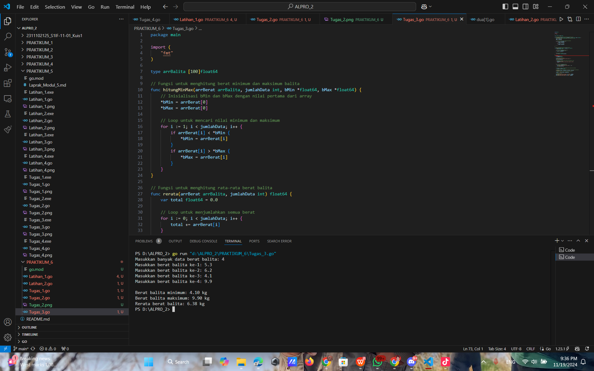

# <h1 align="center">Laporan Praktikum Modul 6 - Nilai Ekstrim</h1>
<p align="center">Naufal Luthfi Assary</p>
<p align="center">2311102125</p>

## Latihan
### Latihan 1.

```GO
package main

import (
	"fmt"
)

type arrInt [2023]int

// Fungsi untuk mencari indeks dari nilai terkecil
func terkecil_2(tabInt arrInt, n int) int {
	var idx int = 0 // indeks data pertama
	var j int = 1   // pencarian dimulai dari data kedua
	for j < n {
		if tabInt[idx] > tabInt[j] { // cek apakah tabInt[j] lebih kecil dari tabInt[idx]
			idx = j // update idx ke indeks baru yang nilainya lebih kecil
		}
		j = j + 1
	}
	return idx // mengembalikan indeks dari nilai terkecil
}

func main() {
	var n int
	var data arrInt

	// Input jumlah elemen N
	fmt.Print("Masukkan jumlah elemen (N <= 2023): ")
	fmt.Scan(&n)

	// Validasi N agar tidak melebihi kapasitas array
	if n <= 0 || n > 2023 {
		fmt.Println("Jumlah elemen harus antara 1 dan 2023")
		return
	}

	// Input elemen-elemen array
	fmt.Println("Masukkan elemen array:")
	for i := 0; i < n; i++ {
		fmt.Scan(&data[i])
	}

	// Panggil fungsi untuk mencari indeks nilai terkecil
	idxTerkecil := terkecil_2(data, n)
	fmt.Printf("Indeks nilai terkecil: %d\n", idxTerkecil)
	fmt.Printf("Nilai terkecil: %d\n", data[idxTerkecil])
}

```

#### Output:


### Latihan 2.

```GO
package main

import (
	"fmt"
)

// Mendefinisikan tipe data mahasiswa
type mahasiswa struct {
	nama, nim, kelas, jurusan string
	ipk                       float64
}

// Mendefinisikan array mahasiswa dengan kapasitas 2023
type arrMhs [2023]mahasiswa

// Fungsi untuk mencari indeks mahasiswa dengan IPK tertinggi
func IPK_2(T arrMhs, n int) int {
	// idx menyimpan indeks mahasiswa dengan IPK tertinggi sementara
	var idx int = 0
	var j int = 1
	for j < n {
		if T[idx].ipk < T[j].ipk {
			idx = j
		}
		j = j + 1
	}
	return idx
}

func main() {
	var n int
	var data arrMhs

	// Input jumlah mahasiswa
	fmt.Print("Masukkan jumlah mahasiswa (N <= 2023): ")
	fmt.Scan(&n)

	// Validasi jumlah mahasiswa
	if n <= 0 || n > 2023 {
		fmt.Println("Jumlah mahasiswa harus antara 1 dan 2023")
		return
	}

	// Input data mahasiswa
	for i := 0; i < n; i++ {
		fmt.Printf("Masukkan data mahasiswa ke-%d\n", i+1)
		fmt.Print("Nama: ")
		fmt.Scan(&data[i].nama)
		fmt.Print("NIM: ")
		fmt.Scan(&data[i].nim)
		fmt.Print("Kelas: ")
		fmt.Scan(&data[i].kelas)
		fmt.Print("Jurusan: ")
		fmt.Scan(&data[i].jurusan)
		fmt.Print("IPK: ")
		fmt.Scan(&data[i].ipk)
	}

	// Panggil fungsi untuk mencari indeks mahasiswa dengan IPK tertinggi
	idxTertinggi := IPK_2(data, n)

	// Tampilkan data mahasiswa dengan IPK tertinggi
	fmt.Println("\nMahasiswa dengan IPK tertinggi:")
	fmt.Printf("Nama    : %s\n", data[idxTertinggi].nama)
	fmt.Printf("NIM     : %s\n", data[idxTertinggi].nim)
	fmt.Printf("Kelas   : %s\n", data[idxTertinggi].kelas)
	fmt.Printf("Jurusan : %s\n", data[idxTertinggi].jurusan)
	fmt.Printf("IPK     : %.2f\n", data[idxTertinggi].ipk)
}

```

#### Output:


## Tugas
### Tugas 1.

```GO
package main

import (
	"fmt"
)

func main() {
	var n int
	fmt.Print("Masukkan jumlah anak kelinci: ")
	fmt.Scan(&n)

	if n <= 0 || n > 1000 {
		fmt.Println("Jumlah anak kelinci harus antara 1 dan 1000")
		return
	}

	weights := make([]float64, n)
	fmt.Println("Masukkan berat anak kelinci:")
	for i := 0; i < n; i++ {
		fmt.Scan(&weights[i])
	}

	minWeight, maxWeight := weights[0], weights[0]

	for _, weight := range weights[1:] {
		if weight < minWeight {
			minWeight = weight
		}
		if weight > maxWeight {
			maxWeight = weight
		}
	}

	fmt.Printf("Berat kelinci terkecil: %.2f\n", minWeight)
	fmt.Printf("Berat kelinci terbesar: %.2f\n", maxWeight)
}

```

#### Output:


### Tugas 2.

```GO
package main

import (
	"fmt"
)

func main() {
	// Deklarasi variabel
	var x, y int
	fmt.Print("Masukkan jumlah ikan (x) dan jumlah ikan per wadah (y): ")
	fmt.Scan(&x, &y)

	// Array untuk menampung data berat ikan dengan kapasitas maksimum 1000
	if x > 1000 {
		fmt.Println("Jumlah ikan tidak boleh lebih dari 1000")
		return
	}
	
	beratIkan := make([]float64, x)

	// Membaca berat setiap ikan
	fmt.Println("Masukkan berat ikan satu per satu:")
	for i := 0; i < x; i++ {
		fmt.Printf("Berat ikan %d: ", i+1)
		fmt.Scan(&beratIkan[i])
	}

	// Menghitung jumlah wadah
	jumlahWadah := (x + y - 1) / y // Pembulatan ke atas jika tidak terbagi rata

	// Menginisialisasi array wadah untuk menyimpan berat setiap wadah
	wadah := make([]float64, jumlahWadah)

	// Memasukkan ikan ke dalam wadah secara berurutan
	for i := 0; i < x; i++ {
		idxWadah := i / y
		wadah[idxWadah] += beratIkan[i]
	}

	// Menampilkan total berat ikan di setiap wadah
	fmt.Println("\nTotal berat ikan di setiap wadah:")
	for i := 0; i < jumlahWadah; i++ {
		fmt.Printf("Wadah %d: %.2f\n", i+1, wadah[i])
	}

	// Menghitung rata-rata berat per wadah
	totalBerat := 0.0
	for i := 0; i < jumlahWadah; i++ {
		totalBerat += wadah[i]
	}
	rataRata := totalBerat / float64(jumlahWadah)

	// Menampilkan rata-rata berat ikan per wadah
	fmt.Printf("\nRata-rata berat ikan di setiap wadah: %.2f\n", rataRata)
}

```

#### Output:


### Tugas 3.

```GO
package main

import (
	"fmt"
)

type arrBalita [100]float64

// Fungsi untuk menghitung berat minimum dan maksimum balita
func hitungMinMax(arrBerat arrBalita, jumlahData int, bMin *float64, bMax *float64) {
	// Inisialisasi bMin dan bMax dengan nilai pertama dari array
	*bMin = arrBerat[0]
	*bMax = arrBerat[0]

	// Loop untuk mencari nilai minimum dan maksimum
	for i := 1; i < jumlahData; i++ {
		if arrBerat[i] < *bMin {
			*bMin = arrBerat[i]
		}
		if arrBerat[i] > *bMax {
			*bMax = arrBerat[i]
		}
	}
}

// Fungsi untuk menghitung rata-rata berat balita
func rerata(arrBerat arrBalita, jumlahData int) float64 {
	var total float64 = 0.0

	// Loop untuk menjumlahkan semua berat
	for i := 0; i < jumlahData; i++ {
		total += arrBerat[i]
	}

	// Menghitung rata-rata
	return total / float64(jumlahData)
}

func main() {
	var jumlahBalita int
	var arrBerat arrBalita

	// Input jumlah data balita
	fmt.Print("Masukkan banyak data berat balita: ")
	fmt.Scan(&jumlahBalita)

	// Memastikan jumlah data tidak lebih dari kapasitas array
	if jumlahBalita > 100 {
		fmt.Println("Jumlah data tidak boleh lebih dari 100")
		return
	}

	// Input berat masing-masing balita
	for i := 0; i < jumlahBalita; i++ {
		fmt.Printf("Masukkan berat balita ke-%d: ", i+1)
		fmt.Scan(&arrBerat[i])
	}

	// Deklarasi variabel untuk menyimpan nilai minimum dan maksimum
	var beratMin, beratMax float64

	// Memanggil fungsi hitungMinMax untuk mencari nilai minimum dan maksimum
	hitungMinMax(arrBerat, jumlahBalita, &beratMin, &beratMax)

	// Memanggil fungsi rerata untuk menghitung rata-rata
	rataRata := rerata(arrBerat, jumlahBalita)

	// Menampilkan hasil
	fmt.Printf("\nBerat balita minimum: %.2f kg\n", beratMin)
	fmt.Printf("Berat balita maksimum: %.2f kg\n", beratMax)
	fmt.Printf("Rerata berat balita: %.2f kg\n", rataRata)
}

```

#### Output:


