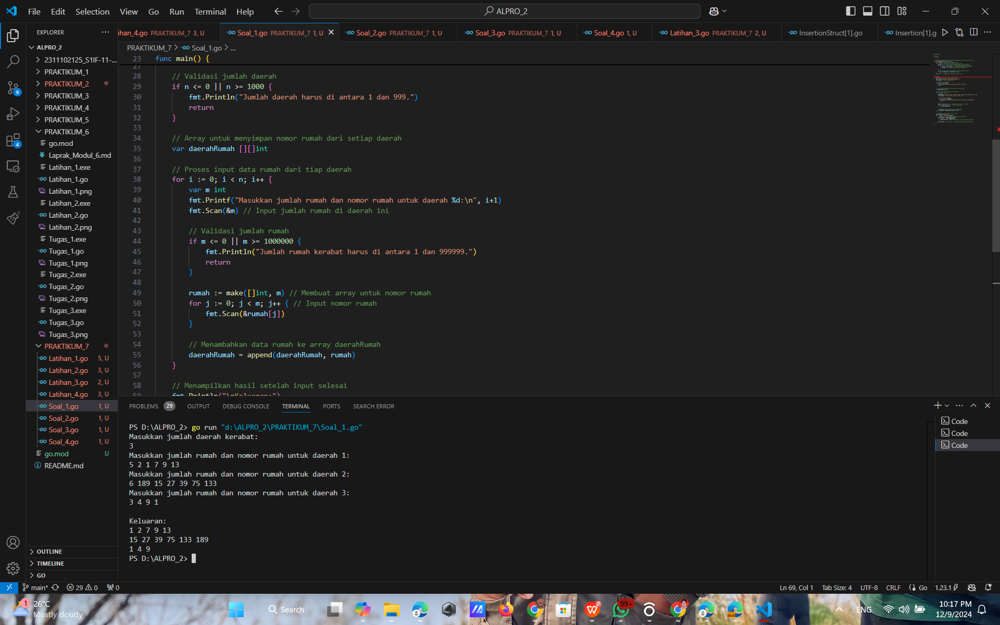

# <h1 align="center">Laporan Praktikum Modul 7 - Pengurutan Data</h1>
<p align="center">Naufal Luthfi Assary</p>
<p align="center">2311102125</p>

## Latihan
### Latihan 1.

```GO
package main

import "fmt"

type arrInt [4321]int

func selectionSort1(T *arrInt, n int) {
	/* I.S. terdefinisi array T yang berisi n bilangan bulat
	   F.S. array T terurut secara ascending atau membesar dengan SELECTION SORT */
	for i := 0; i < n-1; i++ {
		// Inisialisasi indeks minimum
		idx_min := i
		for j := i + 1; j < n; j++ {
			if T[j] < T[idx_min] {
				idx_min = j
			}
		}
		// Tukar elemen T[i] dengan T[idx_min] jika perlu
		if idx_min != i {
			T[i], T[idx_min] = T[idx_min], T[i]
		}
	}
}

func main() {
	// Contoh penggunaan
	var T arrInt
	n := 5
	T[0], T[1], T[2], T[3], T[4] = 64, 34, 25, 12, 22

	fmt.Println("Array sebelum diurutkan:", T[:n])
	selectionSort1(&T, n)
	fmt.Println("Array setelah diurutkan:", T[:n])
}

```

#### Output:


### Latihan 2.

```GO
package main

import "fmt"

type mahasiswa struct {
	nama, nim, kelas, jurusan string
	ipk                       float64
}

type arrMhs [2023]mahasiswa

func selectionSort2(T *arrMhs, n int) {
	/* I.S. terdefinisi array T yang berisi n data mahasiswa
	   F.S. array T terurut secara ascending berdasarkan ipk dengan
	   menggunakan algoritma SELECTION SORT */

	var idx_min int
	var temp mahasiswa

	for i := 0; i < n-1; i++ {
		// Inisialisasi indeks minimum
		idx_min = i

		// Cari elemen dengan IPK terkecil di subarray [i+1, n-1]
		for j := i + 1; j < n; j++ {
			if T[j].ipk < T[idx_min].ipk {
				idx_min = j
			}
		}

		// Tukar elemen di indeks i dengan elemen di idx_min jika perlu
		if idx_min != i {
			temp = T[i]
			T[i] = T[idx_min]
			T[idx_min] = temp
		}
	}
}

func main() {
	// Contoh data mahasiswa
	var T arrMhs
	T[0] = mahasiswa{"Naufal", "123", "A", "Teknik Informatika", 4.0}
	T[1] = mahasiswa{"Micel", "124", "B", "Sistem Informasi", 3.7}
	T[2] = mahasiswa{"iLutS", "125", "A", "Teknik Informatika", 3.9}
	T[3] = mahasiswa{"Celyn", "126", "B", "Sistem Informasi", 3.8}
	n := 4

	fmt.Println("Data mahasiswa sebelum diurutkan:")
	for i := 0; i < n; i++ {
		fmt.Printf("%s - %s - %s - %s - %.2f\n", T[i].nama, T[i].nim, T[i].kelas, T[i].jurusan, T[i].ipk)
	}

	selectionSort2(&T, n)

	fmt.Println("\nData mahasiswa setelah diurutkan berdasarkan IPK:")
	for i := 0; i < n; i++ {
		fmt.Printf("%s - %s - %s - %s - %.2f\n", T[i].nama, T[i].nim, T[i].kelas, T[i].jurusan, T[i].ipk)
	}
}

```

#### Output:


### Latihan 3.

```GO
package main

import "fmt"

type arrInt [4321]int

func insertionSort1(T *arrInt, n int) {
	/* I.S. terdefinisi array T yang berisi n bilangan bulat
	   F.S. array T terurut secara mengecil (descending) dengan INSERTION SORT */
	var temp, i, j int

	for i = 1; i < n; i++ {
		temp = T[i] // Simpan elemen ke-i
		j = i       // Inisialisasi indeks pembanding

		// Geser elemen-elemen sebelumnya yang lebih kecil dari temp
		for j > 0 && temp > T[j-1] {
			T[j] = T[j-1]
			j--
		}

		// Tempatkan temp pada posisi yang sesuai
		T[j] = temp
	}
}

func main() {
	// Contoh penggunaan
	var T arrInt
	n := 5
	T[0], T[1], T[2], T[3], T[4] = 22, 12, 34, 64, 25

	fmt.Println("Array sebelum diurutkan:", T[:n])
	insertionSort1(&T, n)
	fmt.Println("Array setelah diurutkan secara descending:", T[:n])
}

```

#### Output:


### Latihan 4.

```GO
package main

import "fmt"

type mahasiswa struct {
	nama, nim, kelas, jurusan string
	ipk                       float64
}

type arrMhs [2023]mahasiswa

func insertionSort2(T *arrMhs, n int) {
	/* I.S. terdefinisi array T yang berisi n data mahasiswa
	   F.S. array T terurut secara mengecil (descending) berdasarkan nama
	   dengan menggunakan algoritma INSERTION SORT */
	var temp mahasiswa
	var i, j int

	for i = 1; i < n; i++ {
		temp = T[i] // Simpan elemen ke-i
		j = i       // Inisialisasi indeks pembanding

		// Geser elemen-elemen sebelumnya
		for j > 0 && temp.nama > T[j-1].nama {
			T[j] = T[j-1]
			j--
		}

		// Tempatkan temp pada posisi yang sesuai
		T[j] = temp
	}
}

func main() {
	// Contoh data mahasiswa
	var T arrMhs
	T[0] = mahasiswa{"Charlie", "125", "A", "Teknik Informatika", 3.5}
	T[1] = mahasiswa{"Alice", "123", "A", "Teknik Informatika", 3.8}
	T[2] = mahasiswa{"Bob", "124", "B", "Sistem Informasi", 3.2}
	T[3] = mahasiswa{"Diana", "126", "B", "Sistem Informasi", 3.9}
	n := 4

	fmt.Println("Data mahasiswa sebelum diurutkan:")
	for i := 0; i < n; i++ {
		fmt.Printf("%s - %s - %s - %s - %.2f\n", T[i].nama, T[i].nim, T[i].kelas, T[i].jurusan, T[i].ipk)
	}

	insertionSort2(&T, n)

	fmt.Println("\nData mahasiswa setelah diurutkan berdasarkan nama (descending):")
	for i := 0; i < n; i++ {
		fmt.Printf("%s - %s - %s - %s - %.2f\n", T[i].nama, T[i].nim, T[i].kelas, T[i].jurusan, T[i].ipk)
	}
}

```

#### Output:


## Tugas
### Soal 1.

```GO
package main

import (
	"fmt"
)

// Fungsi untuk mengurutkan elemen array menggunakan algoritma selection sort
func selectionSort(arr []int) []int {
    n := len(arr) // Menyimpan panjang array
    for i := 0; i < n-1; i++ { // Iterasi elemen array
        minIdx := i // Anggap elemen pertama sebagai elemen terkecil
        for j := i + 1; j < n; j++ { // Bandingkan dengan elemen lainnya
            if arr[j] < arr[minIdx] { // Jika ada elemen yang lebih kecil
                minIdx = j // Perbarui indeks elemen terkecil
            }
        }
        // Tukar posisi antara elemen terkecil dan elemen di posisi i
        arr[i], arr[minIdx] = arr[minIdx], arr[i]
    }
    return arr // Mengembalikan array yang sudah terurut
}

func main() {
	var n int // Variabel untuk jumlah daerah
	fmt.Println("Masukkan jumlah daerah kerabat:")
	fmt.Scan(&n) // Input jumlah daerah

	// Validasi jumlah daerah
	if n <= 0 || n >= 1000 {
		fmt.Println("Jumlah daerah harus di antara 1 dan 999.")
		return
	}

	// Array untuk menyimpan nomor rumah dari setiap daerah
	var daerahRumah [][]int

	// Proses input data rumah dari tiap daerah
	for i := 0; i < n; i++ {
		var m int
		fmt.Printf("Masukkan jumlah rumah dan nomor rumah untuk daerah %d:\n", i+1)
		fmt.Scan(&m) // Input jumlah rumah di daerah ini

		// Validasi jumlah rumah
		if m <= 0 || m >= 1000000 {
			fmt.Println("Jumlah rumah kerabat harus di antara 1 dan 999999.")
			return
		}

		rumah := make([]int, m) // Membuat array untuk nomor rumah
		for j := 0; j < m; j++ { // Input nomor rumah
			fmt.Scan(&rumah[j])
		}

		// Menambahkan data rumah ke array daerahRumah
		daerahRumah = append(daerahRumah, rumah)
	}

	// Menampilkan hasil setelah input selesai
	fmt.Println("\nKeluaran:")
	for _, rumah := range daerahRumah {
		// Mengurutkan rumah menggunakan fungsi selectionSort
		sortedRumah := selectionSort(rumah)
		for _, num := range sortedRumah {
			fmt.Printf("%d ", num) // Menampilkan rumah yang sudah diurutkan
		}
		fmt.Println() // Pindah baris setelah menampilkan semua rumah daerah
	}
}

```

#### Output:


### Soal 2.

```GO
package main

import (
	"bufio"
	"fmt"
	"os"
	"sort"
	"strconv"
	"strings"
)

func main() {
	scanner := bufio.NewScanner(os.Stdin) // Membaca input dari pengguna
	fmt.Println("Masukkan jumlah daerah:")
	scanner.Scan() // Menerima input jumlah daerah
	t, _ := strconv.Atoi(scanner.Text()) // Mengonversi input menjadi integer

	// Loop untuk menerima data setiap daerah
	for i := 0; i < t; i++ {
		fmt.Printf("Masukkan angka untuk daerah %d (pisahkan dengan spasi):\n", i+1)
		scanner.Scan() // Menerima input deretan angka
		input := scanner.Text()

		// Memanggil fungsi untuk mengubah input menjadi array bilangan bulat
		nums := parseInput(input)

		// Memisahkan angka menjadi ganjil dan genap
		odds, evens := separateOddEven(nums)

		// Mengurutkan bilangan ganjil secara menaik dan bilangan genap secara menurun
		sort.Ints(odds)
		sort.Sort(sort.Reverse(sort.IntSlice(evens)))

		// Menampilkan hasil urutan bilangan ganjil dan genap
		fmt.Printf("Hasil daerah %d:\n", i+1)
		printResult(odds, evens)
	}
}

// Fungsi untuk mengonversi input string menjadi array bilangan bulat
func parseInput(input string) []int {
	parts := strings.Fields(input) // Memisahkan input berdasarkan spasi
	nums := make([]int, len(parts)) // Membuat array untuk menampung angka
	for i, p := range parts {
		nums[i], _ = strconv.Atoi(p) // Mengonversi string menjadi angka
	}
	return nums
}

// Fungsi untuk memisahkan bilangan ganjil dan genap
func separateOddEven(nums []int) ([]int, []int) {
	var odds, evens []int // Membuat slice untuk bilangan ganjil dan genap
	for _, num := range nums {
		if num%2 == 0 {
			evens = append(evens, num) // Jika genap, tambahkan ke slice evens
		} else {
			odds = append(odds, num) // Jika ganjil, tambahkan ke slice odds
		}
	}
	return odds, evens 
}

// Fungsi untuk menampilkan hasil setelah proses pemisahan dan pengurutan
func printResult(odds []int, evens []int) {
	for _, odd := range odds { // Menampilkan bilangan ganjil
		fmt.Print(odd, " ")
	}
	for _, even := range evens { // Menampilkan bilangan genap
		fmt.Print(even, " ")
	}
	fmt.Println() // Pindah baris setelah hasil ditampilkan
}

```

#### Output:


### Soal 3.

```GO
package main

import (
	"fmt"
)

// Fungsi untuk mengurutkan array menggunakan metode insertion sort
func insertionSort(arr []int) []int {
	for i := 1; i < len(arr); i++ { // Mulai dari elemen kedua
		key := arr[i]  // Ambil elemen yang akan disisipkan
		j := i - 1     // Tentukan posisi untuk pengecekan elemen sebelumnya

		// Geser elemen yang lebih besar dari key ke kanan
		for j >= 0 && arr[j] > key {
			arr[j+1] = arr[j]  // Geser elemen
			j--  // Mundur ke elemen sebelumnya
		}
		arr[j+1] = key  // Sisipkan elemen key pada posisi yang benar
	}
	return arr  // Kembalikan array yang sudah terurut
}

// Fungsi untuk memeriksa apakah jarak antar elemen array teratur
func checkDistance(arr []int) string {
	if len(arr) <= 1 {  // Jika array kosong atau hanya memiliki satu elemen
		return "Data berjarak tidak tetap"  // Tidak ada jarak antar elemen
	}

	distance := arr[1] - arr[0]  // Hitung jarak antar elemen pertama dan kedua
	for i := 1; i < len(arr)-1; i++ {  // Periksa semua elemen
		if arr[i+1]-arr[i] != distance {  // Jika jaraknya tidak tetap
			return "Data berjarak tidak tetap"
		}
	}
	return fmt.Sprintf("Data berjarak %d", distance)  // Jika jarak antar elemen tetap
}

func main() {
	var input int
	var data []int  // Array untuk menyimpan input pengguna

	fmt.Println("Masukkan bilangan bulat (akhiri dengan bilangan negatif):")
	for {
		fmt.Scan(&input)  // Menerima input angka
		if input < 0 {  // Jika input negatif, berhenti
			break
		}
		data = append(data, input)  // Menambahkan input ke dalam array
	}

	if len(data) == 0 {  // Jika tidak ada data yang dimasukkan
		fmt.Println("Tidak ada data untuk diproses.")
		return
	}

	// Urutkan array menggunakan insertion sort
	sortedData := insertionSort(data)

	// Periksa apakah jarak antar elemen teratur
	status := checkDistance(sortedData)

	// Menampilkan hasil
	fmt.Println("Keluaran:")
	for _, v := range sortedData {
		fmt.Printf("%d ", v)  // Tampilkan hasil urutan
	}
	fmt.Println()
	fmt.Println(status)  // Tampilkan status jarak antar elemen
}

```

#### Output:


### Soal 4.

```GO
package main

import (
	"bufio"   // Untuk membaca input secara baris per baris
	"fmt"     // Untuk menampilkan output ke layar
	"os"      // Untuk mengambil input dari sistem
	"strconv" // Untuk mengkonversi string ke integer
	"strings" // Untuk memanipulasi string
)

const maxBooks = 7919 

type Buku struct {
	id        int    
	judul     string 
	penulis   string 
	penerbit  string 
	tahun     int    
	rating    int    
}

// Fungsi untuk mendaftarkan buku ke dalam perpustakaan
func DaftarkanBuku(perpustakaan []Buku, jumlahBuku int) []Buku {
	reader := bufio.NewReader(os.Stdin) // Membuat reader untuk menerima input
	for i := 0; i < jumlahBuku; i++ {
		fmt.Printf("\nMasukkan data untuk buku ke-%d:\n", i+1)

		// Meminta ID buku
		fmt.Print("ID: ")
		idInput, _ := reader.ReadString('\n')
		idInput = strings.TrimSpace(idInput)
		id, _ := strconv.Atoi(idInput)

		// Meminta Judul buku
		fmt.Print("Judul: ")
		judul, _ := reader.ReadString('\n')
		judul = strings.TrimSpace(judul)

		// Meminta Penulis buku
		fmt.Print("Penulis: ")
		penulis, _ := reader.ReadString('\n')
		penulis = strings.TrimSpace(penulis)

		// Meminta Penerbit buku
		fmt.Print("Penerbit: ")
		penerbit, _ := reader.ReadString('\n')
		penerbit = strings.TrimSpace(penerbit)

		// Meminta Tahun terbit buku
		fmt.Print("Tahun: ")
		tahunInput, _ := reader.ReadString('\n')
		tahunInput = strings.TrimSpace(tahunInput)
		tahun, _ := strconv.Atoi(tahunInput)

		// Meminta Rating buku
		fmt.Print("Rating: ")
		ratingInput, _ := reader.ReadString('\n')
		ratingInput = strings.TrimSpace(ratingInput)
		rating, _ := strconv.Atoi(ratingInput)

		// Menyimpan buku ke dalam perpustakaan
		perpustakaan[i] = Buku{id, judul, penulis, penerbit, tahun, rating}
	}
	return perpustakaan
}

// Fungsi untuk mengurutkan buku berdasarkan rating secara menurun menggunakan metode Insertion Sort
func UrutkanBuku(perpustakaan []Buku, jumlahBuku int) {
	for i := 1; i < jumlahBuku; i++ {
		key := perpustakaan[i]  // Buku yang akan diposisikan
		j := i - 1

		// Memindahkan buku dengan rating lebih rendah ke kanan
		for j >= 0 && perpustakaan[j].rating < key.rating {
			perpustakaan[j+1] = perpustakaan[j]
			j--
		}
		perpustakaan[j+1] = key // Menempatkan buku pada posisi yang tepat
	}
}

// Fungsi untuk menampilkan buku dengan rating tertinggi
func TampilkanBukuFavorit(perpustakaan []Buku, jumlahBuku int) {
	if jumlahBuku == 0 { // Jika perpustakaan kosong
		fmt.Println("Tidak ada buku di perpustakaan.") 
		return
	}

	favoriteIdx := 0                             // Indeks buku dengan rating tertinggi
	highestRating := perpustakaan[0].rating      // Rating dari buku pertama

	// Menelusuri buku untuk mencari yang memiliki rating tertinggi
	for i := 1; i < jumlahBuku; i++ {
		if perpustakaan[i].rating > highestRating {
			highestRating = perpustakaan[i].rating
			favoriteIdx = i
		}
	}

	// Menampilkan buku dengan rating tertinggi
	fmt.Println("\nBuku Terfavorit:")
	fmt.Printf("Judul: %s\nPenulis: %s\nPenerbit: %s\nTahun: %d\nRating: %d\n",
		perpustakaan[favoriteIdx].judul, perpustakaan[favoriteIdx].penulis,
		perpustakaan[favoriteIdx].penerbit, perpustakaan[favoriteIdx].tahun,
		perpustakaan[favoriteIdx].rating)
}

// Fungsi untuk menampilkan lima buku teratas berdasarkan rating tertinggi
func Tampilkan5BukuTeratas(perpustakaan []Buku, jumlahBuku int) {
	fmt.Println("\n5 Buku Teratas dengan Rating Tertinggi:")
	// Memastikan buku sudah diurutkan sebelum ditampilkan
	UrutkanBuku(perpustakaan, jumlahBuku)
	for i := 0; i < 5 && i < jumlahBuku; i++ {
		fmt.Printf("Judul: %s, Rating: %d\n", perpustakaan[i].judul, perpustakaan[i].rating)
	}
}

// Fungsi untuk mencari buku berdasarkan rating tertentu
func CariBukuBerdasarkanRating(perpustakaan []Buku, jumlahBuku int, ratingYangDicari int) {
	found := false // Menandakan apakah buku ditemukan

	// Mencari buku dengan rating tertentu
	fmt.Printf("\nBuku dengan rating %d:\n", ratingYangDicari)
	for i := 0; i < jumlahBuku; i++ {
		if perpustakaan[i].rating == ratingYangDicari {
			// Menampilkan detail buku
			fmt.Printf("Judul: %s\nPenulis: %s\nPenerbit: %s\nTahun: %d\nRating: %d\n\n",
				perpustakaan[i].judul, perpustakaan[i].penulis,
				perpustakaan[i].penerbit, perpustakaan[i].tahun,
				perpustakaan[i].rating)
			found = true
		}
	}

	// Jika tidak ada buku dengan rating tersebut
	if !found {
		fmt.Printf("Tidak ada buku dengan rating %d\n", ratingYangDicari)
	}
}

// Program utama
func main() {
	reader := bufio.NewReader(os.Stdin) // Membuat reader untuk menerima input

	// Meminta jumlah buku yang ada di perpustakaan
	fmt.Print("Masukkan jumlah buku di perpustakaan: ")
	jumlahBukuInput, _ := reader.ReadString('\n')
	jumlahBukuInput = strings.TrimSpace(jumlahBukuInput)
	jumlahBuku, _ := strconv.Atoi(jumlahBukuInput)

	// Membuat pustaka dengan jumlah buku yang ditentukan
	var perpustakaan = make([]Buku, jumlahBuku)

	// Mendaftarkan buku ke dalam perpustakaan
	perpustakaan = DaftarkanBuku(perpustakaan, jumlahBuku)

	// Mengurutkan buku berdasarkan rating
	UrutkanBuku(perpustakaan, jumlahBuku)

	// Menampilkan buku dengan rating tertinggi
	TampilkanBukuFavorit(perpustakaan, jumlahBuku)

	// Menampilkan lima buku teratas berdasarkan rating tertinggi
	Tampilkan5BukuTeratas(perpustakaan, jumlahBuku)

	// Mencari buku berdasarkan rating yang diinginkan
	var ratingYangDicari int
	fmt.Print("\nMasukkan rating untuk mencari buku: ")
	fmt.Scanf("%d\n", &ratingYangDicari)
	CariBukuBerdasarkanRating(perpustakaan, jumlahBuku, ratingYangDicari)
}

```

#### Output:


